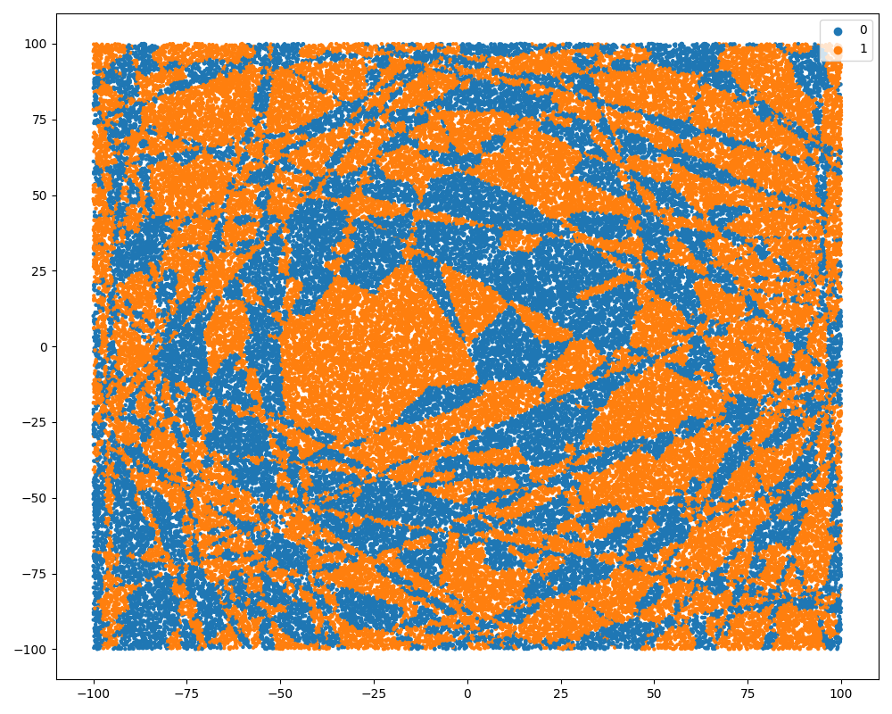

<head>
    
    

</head>

## Setup
### Example of an env
We use a Voronoi partitioning of 2D space. We choose 2D space because it's easiest to visualize. We choose Voronoi partitions because it's very hard for a deep neural network to learn. 

## Modeling
All of the following equations use the following shared definitions.

$$
\begin{align*}
& N = \text{batch size} \\
& D = \text{dimension of environment} \\
& X = \text{inputs to classify of shape (N, D)} \\
& \mathcal{C} = \text{Voronoi centers} \\
& C = \text{classes} \\
& \theta = \text{model parameters} \\
& \mathcal{L}(\hat{y}, y) = \text{loss function. Crossentropy in this case} \\
& f_\theta = \text{classifier} \\
& J_\theta = \text{objective function} = \mathcal{L}(f_\theta(X), y)\\
\end{align*}
$$

### Exact algorithm
$$
\begin{align*}
& f_\theta = \arg \min_C \left|\frac{X^T\mathcal{C}}{\|\mathcal{C}\|_2^2} - 1\right|
\end{align*}
$$

### Learning which centers correspond to which class
$$
\begin{align*}
& C_\theta = \text{Linear layer (} |\mathcal{C}||C| \text{ parameters)} \\
& f_\theta = \text{softmax}\left(-\left|\frac{X^T\mathcal{C}}{\|\mathcal{C}\|_2^2} - 1\right|\right)C_\theta
\end{align*}
$$

### ...And learning that values closer to 1 are better
$$
\begin{align*}
& C_\theta = \text{Linear layer (} |\mathcal{C}||C| \text{ parameters)} \\
& \text{offset}_\theta = \text{Offset (1 parameter)} \\
& f_\theta = \text{softmax}\left(-\left|\frac{X^T\mathcal{C}}{\|\mathcal{C}\|_2^2} - \text{offset}_\theta\right|\right)C_\theta
\end{align*}
$$

### ...And learning that larger scales leads to better softmax outputs
$$
\begin{align*}
& C_\theta = \text{Linear layer (} |\mathcal{C}||C| \text{ parameters)} \\
& \text{offset}_\theta = \text{Offset (1 parameter)} \\
& \text{scale}_\theta = \text{Softmax conditioning scale (1 parameter)} \\
& f_\theta = \text{softmax}\left(-\text{scale}_\theta \left|\frac{X^T\mathcal{C}}{\|\mathcal{C}\|_2^2} - \text{offset}_\theta\right|\right)C_\theta
\end{align*}
$$

### ...And learning to use ReLU instead of absolute value
$$
\begin{align*}
& C_\theta = \text{Linear layer (} |\mathcal{C}||C| \text{ parameters)} \\
& \text{offset}_\theta = \text{Offset (1 parameter)} \\
& \text{scale}_\theta = \text{Softmax conditioning scale (1 parameter)} \\
& \text{pm}_\theta = \text{Plus-minus parameter for learning absolute value (2 parameters)} \\
& f_\theta = \text{softmax}\left(-\text{scale}_\theta * \text{pm}_\theta * \text{ReLU}\left(\frac{X^T\mathcal{C}}{\|\mathcal{C}\|_2^2} - \text{offset}_\theta\right)\right)C_\theta
\end{align*}
$$

### ...And learning the centers from scratch
$$
\begin{align*}
& C_\theta = \text{Linear layer (} |\mathcal{C}||C| \text{ parameters)} \\
& \text{offset}_\theta = \text{Offset (1 parameter)} \\
& \text{scale}_\theta = \text{Softmax conditioning scale (1 parameter)} \\
& \text{pm}_\theta = \text{Plus-minus parameter for learning absolute value (2 parameters)} \\
& \mathcal{C}_\theta = \text{Learned Voronoi centers (2048} D \text{ parameters)}\\
& f_\theta = \text{softmax}\left(-\text{scale}_\theta * \text{pm}_\theta * \text{ReLU}\left(\frac{X^T\mathcal{C}_\theta}{\|\mathcal{C}_\theta\|_2^2} - \text{offset}_\theta\right)\right)C_\theta
\end{align*}
$$

## Optimization

### AdamW L2 weight decay (default)

### AdamW L1 weight decay

### AdamW L1 and L2 proportional weight decay

